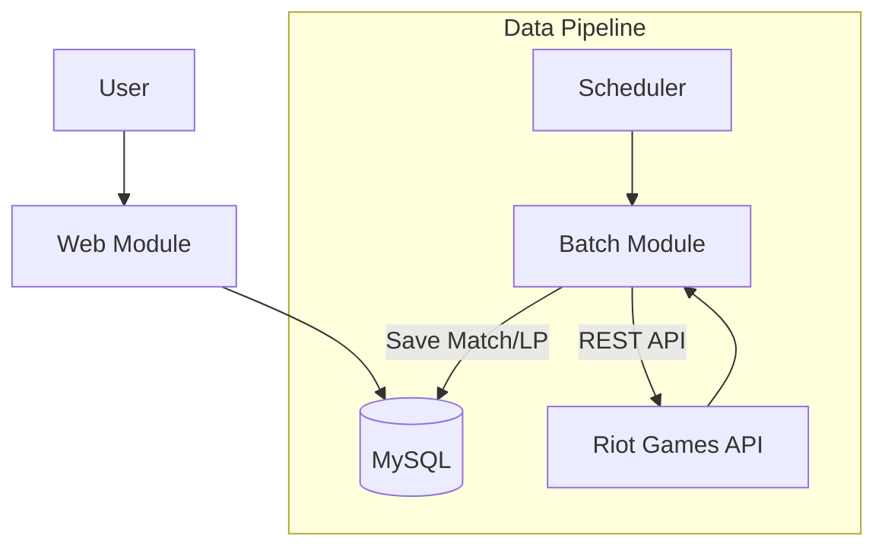

# 🎮 TFT.GG - High-Volume Data Pipeline & Ranking Service

## 📌 Project Overview
**TFT.GG** is a backend-focused service that collects massive match data from the Riot Games API and provides real-time player rankings. The project focuses on building a **resilient batch system** that strictly adheres to API rate limits and optimizing database queries for high-performance ranking display.

- **Core Goal:** Build a fault-tolerant data collection system and a fast ranking service.
- **Role:** Backend Engineer (Solo Project).
- **Key Features:** Multi-module Architecture, DB-backed Job Queue, Query Optimization.

---

## 🛠 Tech Stack

### Backend
- **Framework:** Spring Boot 3.5.8 (Multi-module)
- **Language:** Java 21 (Batch), Java 17 (Web)
- **Data Access:** Spring Data JPA, MyBatis
- **Database:** MySQL
- **External API:** Riot Games API (TFT)

---

## 🚀 Key Features

### 1. High-Availability Data Collection (Batch Module)
- **State-based Job Queue:** Manages collection tasks via a `MatchFetchQueue` table with statuses (`READY`, `DONE`, `FAIL`), ensuring no data loss even during system restarts.
- **Targeted Collection:** Prioritizes tracking High-ELO (Master+) players for high-quality data.

### 2. Robust API Rate Limit Handling
- **Smart Throttling:** Automatically parses the `Retry-After` header from `429 Too Many Requests` errors and waits for the exact required duration before retrying.
- **Fail-safe Logic:** Resets failed tasks to `READY` status to be picked up by the next batch cycle, ensuring continuous operation.

### 3. Optimized Ranking Service (Web Module)
- **Real-time Leaderboard:** Displays player rankings based on collected LP data.
- **Performance Tuning:** Solved the N+1 query problem when fetching profile data for rankers.

---

## 💡 Technical Deep Dive & Troubleshooting

### ✅ 1. Handling API Rate Limits & Stability
**Challenge:** Naive API calls led to frequent `429` errors and temporary bans due to strict rate limits.
**Solution:**
- Implemented **Smart Backoff** in `MatchFetchService`.
- The system catches `HttpClientErrorException.TooManyRequests`, sleeps for the `Retry-After` duration, and retries.
- **Result:** Achieved 0% data loss and enabled 24/7 continuous data collection.

### ✅ 2. Optimizing Ranking Page (N+1 Problem)
**Challenge:** Rendering the top 100 rankers triggered 100 additional SELECT queries to fetch player profiles (N+1 problem).
**Solution:**
- **Batch Fetching:** Refactored the code to fetch all 100 profiles in a single query using the `IN` clause (`findLatestParticipantsByPuuids`).
- **In-Memory Mapping:** Converted the list to a `Map<String, Dto>` for O(1) access during rendering.
- **Result:** Reduced DB queries from **101 to 2** per page load.

### ✅ 3. Multi-Module Architecture
**Challenge:** Heavy batch processing logic slowed down the user-facing web application when they shared the same context.
**Solution:**
- Physically separated the project into `batch` and `web` modules.
- **Result:** Batch processing (high CPU/Network usage) no longer impacts the response time of the Web module.

---

## 🏗 System Architecture

