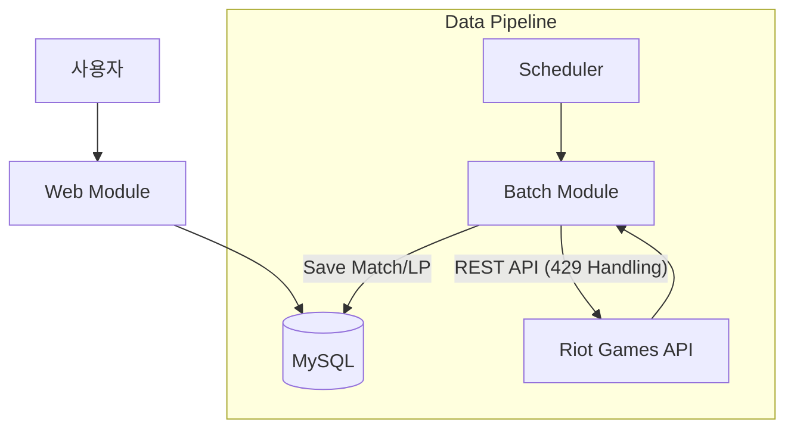

# 🎮 TFT.GG - 대규모 데이터 파이프라인 및 랭킹 서비스

## 📌 프로젝트 개요
**TFT.GG**는 라이엇 게임즈(Riot Games)의 API를 연동하여 대규모 매치 데이터를 안정적으로 수집하고, 이를 기반으로 실시간 랭킹과 전적 정보를 제공하는 백엔드 중심의 서비스입니다. 외부 API의 엄격한 호출 제한(Rate Limit)을 극복하기 위한 **비동기 큐 시스템** 설계와 랭킹 페이지의 **조회 성능 최적화**에 주력했습니다.

- **핵심 목표:** API 제한을 준수하는 무중단 데이터 수집 시스템 구축 및 빠른 랭킹 조회 서비스 제공
- **개발 인원:** 1인 (개인 프로젝트)
- **주요 특징:** 멀티 모듈(Batch/Web) 아키텍처, DB 기반 작업 큐, 쿼리 튜닝

---

## 🛠 사용 기술 (Tech Stack)

### Backend
- **Framework:** Spring Boot 3.5.8 (Multi-module)
- **Language:** Java 21 (Batch), Java 17 (Web)
- **Data Access:** Spring Data JPA (도메인), MyBatis (통계/배치)
- **Database:** MySQL
- **External API:** Riot Games API (TFT)

### Frontend
- **Engine:** Thymeleaf
- **UI:** Bootstrap 5

### DevOps & Tools
- **Build:** Maven
- **Scheduling:** Spring Scheduler

---

## 🚀 핵심 기능 (Key Features)

### 1. 고가용성 데이터 수집 시스템 (Batch Module)
- **상태 기반 작업 큐(Queue):** `MatchFetchQueue` 테이블을 통해 수집 작업의 상태(`READY` → `DONE` / `FAIL`)를 관리하여, 시스템 재시작 시에도 누락 없이 작업을 이어갈 수 있습니다.
- **티어별 수집 전략:** 마스터 티어 이상(High ELO) 유저를 우선적으로 추적하여 데이터의 질을 높였습니다.

### 2. API 호출 제한 완벽 대응
- **Smart Throttling:** 라이엇 API의 `Retry-After` 헤더를 분석하여, 429 에러(Too Many Requests) 발생 시 정확한 시간만큼 대기 후 자동으로 재시도합니다.
- **Fail-safe Logic:** 일시적인 네트워크 오류나 API 장애 발생 시 해당 작업을 `READY` 상태로 되돌려 다음 배치 사이클에 다시 수행되도록 설계했습니다.

### 3. 고성능 랭킹 서비스 (Web Module)
- **실시간 리더보드:** 수집된 LP 데이터를 기반으로 플레이어 순위를 제공합니다.
- **성능 최적화:** 대량의 프로필 데이터를 조회하는 과정에서 발생하는 병목 현상을 해결했습니다.

---

## 💡 기술적 도전 및 문제 해결 (Troubleshooting)

### ✅ 1. 외부 API의 Rate Limit 핸들링과 안정성 확보
- **문제:** 단순 루프 방식으로 API를 호출할 경우, 초당/분당 제한에 걸려 다수의 요청이 실패하고 계정이 일시 차단되는 문제 발생.
- **해결:**
    - `MatchFetchService`에 **Smart Backoff** 로직을 구현했습니다. `HttpClientErrorException.TooManyRequests` 예외를 포착하여 API가 지시하는 대기 시간(Retry-After)을 준수하도록 스레드 제어(`Thread.sleep`)를 적용했습니다.
    - 이를 통해 데이터 유실률 0%를 달성하고, 24시간 무중단 수집이 가능한 파이프라인을 구축했습니다.

### ✅ 2. 랭킹 페이지 조회 속도 개선 (N+1 문제 해결)
- **문제:** 상위 100명의 랭킹을 렌더링할 때, 각 유저의 상세 정보(아이콘, 닉네임 등)를 조회하기 위해 100번의 추가 SELECT 쿼리가 발생(N+1 문제).
- **해결:**
    - **Fetch Strategy 변경:** `IN` 절을 활용하여 100명의 프로필 ID를 한 번의 쿼리로 조회(`findLatestParticipantsByPuuids`)했습니다.
    - **In-Memory Mapping:** 조회된 리스트를 Java의 `Map<String, Dto>` 구조로 변환하여, 렌더링 시 O(1)의 속도로 매칭했습니다.
    - **결과:** 페이지 로딩 시 DB 접근 횟수를 **101회 → 2회**로 획기적으로 줄여 응답 속도를 개선했습니다.

### ✅ 3. 멀티 모듈 아키텍처 설계
- **문제:** 웹 서비스(사용자 트래픽)와 데이터 수집기(배치 작업)가 하나의 프로젝트에 섞여 있어, 배치 작업의 부하가 웹 서비스 속도에 영향을 줌.
- **해결:**
    - **관심사의 분리:** 프로젝트를 `batch` 모듈과 `web` 모듈로 물리적으로 분리했습니다.
    - **결과:** 배치 모듈이 수만 건의 데이터를 처리하며 CPU를 점유해도, 웹 모듈의 톰캣 스레드에는 영향을 주지 않는 독립적인 실행 환경을 구성했습니다.

---

## 🏗 시스템 아키텍처 (Architecture)

---
*본 포트폴리오는 프로젝트의 핵심인 데이터 파이프라인 구축 및 성능 최적화 역량에 집중하여 작성되었습니다.*