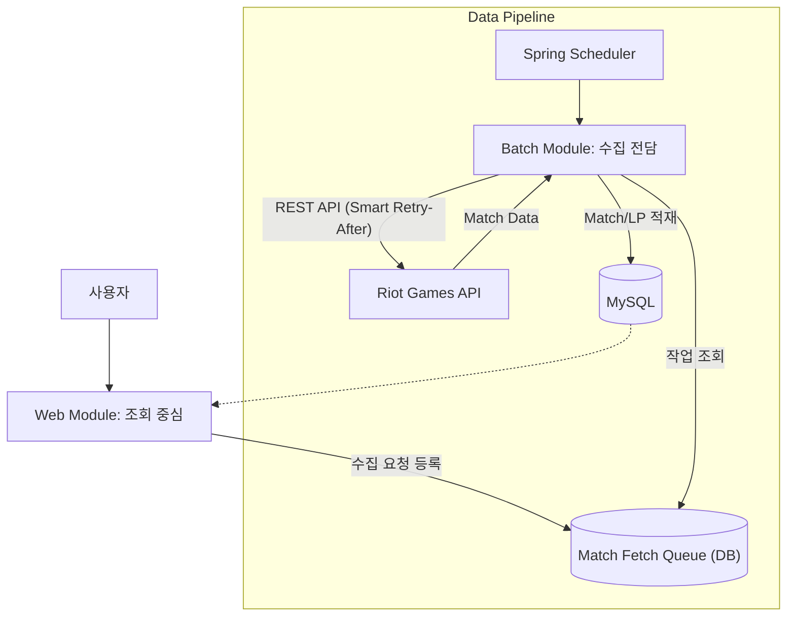

# TFT.GG : 전략적 팀 전투 전적 조회 서비스

## 프로젝트 개요
**TFT.GG**는 라이엇 게임즈(Riot Games)의 API를 연동하여 대량의 매치 데이터를 안정적으로 수집하고, 이를 기반으로 실시간 랭킹과 전적 정보를 제공하는 백엔드 중심의 서비스입니다. 이전 프로젝트의 한계점이었던 엄격한 외부 API 호출 제한(Rate Limit)을 극복하기 위해 **비동기 큐 시스템** 설계와 랭킹 페이지의 **조회 성능 최적화**에 주력했습니다.

- **핵심 목표:** API 제한을 준수하는 무중단 데이터 수집 시스템 구축 및 빠른 전적 조회 서비스 제공
- **개발 인원:** 1인 (개인 프로젝트)
- **주요 특징:** 멀티 모듈(Batch/Web) 아키텍처, DB 기반 작업 큐

---

## 사용 기술

- **Backend :** Java, Spring Boot, Spring Data JPA, Spring Scheduler
- **Database :** MySQL
- **Frontend :** Thymeleaf, JavaScript (ES6+), HTML5, CSS3
- **External API :** Riot Games API (TFT)

---

## 핵심 기능 (Key Features)

### 1. 비동기 데이터 수집 시스템
- **상태 기반 작업 큐:** `MatchFetchQueue` 테이블을 통해 수집 작업의 상태(`READY` → `DONE` / `FAIL`)를 관리하여, 시스템 재시작 시에도 누락 없이 작업을 이어갈 수 있습니다.
- **중복 수집 방지**: MySQL의 'UPDATE-JOIN' 문을 활용해 작업 선택과 상태 변경을 단일 쿼리로 처리하는 원자적 작업 점유 로직을 구현하여 중복 수집을 차단했습니다.
- **티어별 수집 전략:** 챌린저와 그랜드 마스터 티어 유저를 우선적으로 추적하여 데이터의 질을 높였습니다.

### 2. API 호출 제한 완벽 대응
- **지능적 호출 제어:** 라이엇 API의 `Retry-After` 헤더를 분석하여, 429 에러(Too Many Requests) 발생 시 정확한 시간만큼 대기 후 자동으로 재시도합니다.
- **장애 복구 작업:** 일시적인 네트워크 오류나 API 장애 발생 시 해당 작업을 `READY` 상태로 되돌려 다음 배치 사이클에 다시 수행되도록 설계했습니다.

### 3. 랭킹 및 전적 페이지
- **실시간 리더보드:** Batch 서버에서 주기적으로 업데이트하는 LP를 기반으로 상위 랭커 순위를 실시간 제공합니다.
- **사용자 중심 레이아웃**: 챔피언 초상화와 아이템 아이콘을 매핑하고, 유닛 리스트를 코스트가 높은 순으로 자동 정렬하여 덱의 핵심 기물을 한눈에 확인할 수 있는 전적 조회 화면을 구성했습니다.
- **티어 보정 LP 추이 그래프 :** Chart.js를 활용해 최근 점수 변화를 시각화하되, 승급/강등 시의 단절을 보정하는 티어 보정 점수 로직을 적용하여 실질적인 성장 곡선을 구현했습니다.

---

## 트러블슈팅

### 1. 외부 API의 Rate Limit 핸들링과 안정성 확보
- **문제:** 단순 루프 방식으로 API를 호출할 경우, 초당/분당 제한에 걸려 다수의 요청이 실패하고 계정이 일시 차단되는 문제 발생.
- **해결:**
    - `MatchFetchService`에 **지능적 호출 제어** 로직을 구현했습니다. `HttpClientErrorException.TooManyRequests` 예외를 포착하여 API가 지시하는 대기 시간(Retry-After)을 준수하도록 스레드 제어(`Thread.sleep`)를 적용했습니다.
    - 이를 통해 데이터 유실률 0%를 달성하고, 24시간 무중단 수집이 가능한 파이프라인을 구축했습니다.

### 2. 랭킹 페이지 조회 속도 개선 (N+1 문제 해결)
- **문제:** 상위 100명의 랭킹을 렌더링할 때, 각 유저의 상세 정보(아이콘, 닉네임 등)를 조회하기 위해 100번의 추가 SELECT 쿼리가 발생(N+1 문제).
- **해결:**
    - **데이터 일괄 조회:** `IN` 절을 활용하여 100명의 프로필 ID를 한 번의 쿼리로 조회(`findLatestParticipantsByPuuids`)했습니다.
    - **메모리 내 데이터 구조화:** 조회된 리스트를 Java의 `Map<String, Dto>` 구조로 변환하여, 렌더링 시 O(1)의 속도로 매칭했습니다.
    - **결과:** 페이지 로딩 시 DB 접근 횟수를 **101회 → 2회**로 획기적으로 줄여 응답 속도를 개선했습니다.

### 3. 멀티 모듈 아키텍처 설계
- **문제:** 웹 서비스(사용자 트래픽)와 데이터 수집기(배치 작업)가 하나의 프로젝트에 섞여 있어, 배치 작업의 부하가 웹 서비스 속도에 영향을 줌.
- **해결:**
    - **관심사의 분리:** 프로젝트를 `batch` 모듈과 `web` 모듈로 물리적으로 분리했습니다.
    - **결과:** 배치 모듈이 수만 건의 데이터를 처리하며 CPU를 점유해도, 웹 모듈의 톰캣 스레드에는 영향을 주지 않는 독립적인 실행 환경을 구성했습니다.

---

## 시스템 아키텍처

---
*본 포트폴리오는 프로젝트의 핵심인 데이터 파이프라인 구축 및 성능 최적화 역량에 집중하여 작성되었습니다.*
