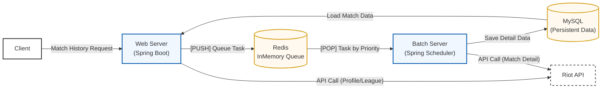

# TFT.GG : 전략적 팀 전투 전적 조회 서비스

## 프로젝트 개요
**TFT.GG**는 라이엇 게임즈(Riot Games)의 API를 연동하여 대량의 매치 데이터를 안정적으로 수집하고, 이를 기반으로 실시간 랭킹과 전적 정보를 제공하는 백엔드 중심의 서비스입니다. 이전 프로젝트의 한계점이었던 엄격한 외부 API 호출 제한(Rate Limit)을 극복하기 위해 **서버 분리** 및 **비동기 큐 시스템** 설계와 랭킹 페이지의 **조회 성능 최적화**에 주력했습니다.

- **핵심 목표:** API 제한을 준수하는 무중단 데이터 수집 시스템 구축 및 빠른 전적 조회 서비스 제공
- **개발 인원:** 1인 (개인 프로젝트)
- **주요 특징:** 멀티 모듈(Batch/Web) 아키텍처, Redis 인메모리 비동기 작업 큐

---

## 사용 기술

- **Backend :** Java, Spring Boot, Spring Data JPA, Spring Scheduler
- **Database / Cache :** MySQL, Redis
- **Frontend :** Thymeleaf, JavaScript (ES6+), HTML5, CSS3
- **External API :** Riot Games API (TFT)

---

## 실행 방법 (Getting Started)

본 프로젝트를 로컬에서 실행하기 위해서는 최상위 경로에 반드시 `.env` 파일을 생성하고 아래 환경 변수 값들을 기입해야 정상 작동합니다.

```env
# 프로젝트 루트 디렉토리에 .env 파일 생성 후 기입
MYSQL_ROOT_PASSWORD=your_root_password
MYSQL_USER=your_db_user
MYSQL_PASSWORD=your_db_password

# Riot Games Developer Portal에서 발급받은 API KEY
RIOT_API_KEY=your_riot_api_key
```

### Docker 실행
Docker Compose를 사용하여 백엔드 환경(Web, Batch)과 Data 인프라(MySQL, Redis)를 한 번에 구축합니다.
```bash
docker-compose up -d --build
```

---

## 핵심 기능 (Key Features)


### 1. 웹/배치 분리와 비동기 데이터 수집 시스템
- **인메모리 작업 큐 도입:** 대량의 매치 데이터 수집 시 관계형 데이터베이스(RDBMS)에 작업 대기열을 기록하고 폴링(Polling)할 경우 발생하는 디스크 I/O 부하와 Lock 경합 문제를 해결하기 위해, **Redis**를 활용한 인메모리 비동기 큐를 구축했습니다.
- **우선순위 기반 작업 할당:** 챌린저 등 우선 조회가 필요한 유저 수집을 Redis의 점수(Score) 기능으로 관리합니다. 이를 통해 DB Lock 경합 없이 안전하게 우선순위에 따라 작업을 배분합니다.
- **티어별 수집 전략:** 챌린저와 그랜드 마스터 티어 유저를 우선적으로 추적하여 데이터의 질을 높였습니다.

### 2. API 호출 제한 대응 및 복구
- **지능적 호출 제어:** 라이엇 API의 `Retry-After` 헤더를 분석하여, 429 에러(Too Many Requests) 발생 시 해당 대기 시간만큼 스케줄러를 대기하도록 처리했습니다.
- **유연한 Re-queue 처리:** 네트워크 오류 등 일시적 문제 발생 시, 해당 작업을 DB 에러 상태로 기록하는 대신 **Redis 큐에 다시 밀어넣어(Re-queue) 재시도** 하도록 설계하여 안정성을 높였습니다.

### 3. 랭킹 및 전적 페이지
- **실시간 리더보드:** Batch 서버에서 주기적으로 업데이트하는 LP를 기반으로 상위 랭커 순위를 실시간 제공합니다.
- **사용자 중심 레이아웃**: 챔피언 초상화와 아이템 아이콘을 매핑하고, 유닛 리스트를 코스트가 높은 순으로 자동 정렬하여 덱의 핵심 기물을 한눈에 확인할 수 있는 전적 조회 화면을 구성했습니다.
- **티어 보정 LP 추이 그래프 :** Chart.js를 활용해 최근 점수 변화를 시각화하되, 승급/강등 시의 단절을 보정하는 티어 보정 점수 로직을 적용하여 실질적인 성장 곡선을 구현했습니다.

---

## 트러블슈팅

### 1. 외부 API의 Rate Limit 핸들링과 안정성 확보
- **문제:** 단순 루프 방식으로 API를 호출할 경우, 초당/분당 제한에 걸려 다수의 요청이 실패하고 데이터 수집이 일시 중단되는 문제 발생.
- **해결:**
    - `MatchFetchService`에 지능적 호출 제어 로직을 구현했습니다. `HttpClientErrorException.TooManyRequests` 예외를 포착하여 API가 지시하는 대기 시간(Retry-After)을 준수하도록 스레드 제어(`Thread.sleep`)를 적용했습니다.
    - 이를 통해 데이터 유실 없이 안정적인 수집 파이프라인을 구축했습니다.

### 2. 멀티 모듈 아키텍처 및 비동기 파이프라인 설계
- **문제:** 전적 조회 요청 시, 사용자의 수백 건의 매치 데이터를 실시간 동기식으로 모두 수집하게 되면 외부 API 호출 제한 지연으로 인해 화면 응답 속도가 무한정 길어지는 구조적 한계가 존재했습니다.
- **해결:**
    - **관심사의 분리:** 즉각적인 사용자 화면 렌더링을 처리하는 Web 서버와, 백그라운드 데이터 수집을 전담하는 Batch 서버로 역할을 분리했습니다.
    - **비동기 큐 기반 100% 위임:** 사용자의 티어, 레벨, 닉네임 등 프로필 렌더링을 위한 기본 필수 정보만 API로 즉시 동기 호출하여 응답하고, 수백 건의 무거운 매치 상세 수집 작업은 **Redis 큐에 비동기로 위임(Push)하여 백그라운드에서 배치 서버가 수집(Pop)** 하도록 설계했습니다.
    - **결과:** 엄청난 양의 외부 API 통신과 데이터를 수집하는 과정에서도 Web 서버의 응답 속도에는 전혀 영향을 주지 않는, 무중단 데이터 파이프라인 구조를 구축했습니다.
 
### 3. 전적 조회 성능 최적화 (N+1 문제 해결)
- **문제:** 전적 조회 시 4단계(GameInfo-Participant-Unit-Item) 연관 데이터를 개별 호출하며 발생하는 N+1 문제와 다중 컬렉션 조인에 따른 카테시안 곱 현상으로 응답 속도 저하 문제 발생.
- **해결:**
    - **로딩 최적화:** 다중 조인을 제거하고 `@BatchSize`를 적용하여 계층별로 흩어진 수백 건의 쿼리를 단 4회의 IN 쿼리로 최적화했습니다.
    - **데이터 처리 최적화:** 어플리케이션 계층의 통계 연산을 DB 집계 함수로 이관하고 인덱스를 적용하여 데이터 가공 속도를 개선했습니다.
    - **결과:** 응답 속도를 5.0s에서 0.6s로 약 88% 단축하여 대규모 데이터 환경에서도 안정적인 서비스 가용성 확보.

---

## 시스템 아키텍처


```mermaid
graph LR
    %% 스타일 정의
    classDef client fill:#fff,stroke:#333,stroke-width:2px;
    classDef server fill:#f0f7ff,stroke:#0055aa,stroke-width:2px;
    classDef db fill:#fff9f0,stroke:#d4a017,stroke-width:2px;
    classDef external fill:#fff,stroke:#555,stroke-width:2px,stroke-dasharray: 5 5;

    %% 노드 설정 
    Client[Client]:::client
    Web["Web Server<br/>(Spring Boot)"]:::server
    Redis[("Redis<br/>InMemory Queue")]:::db
    MySQL[("MySQL<br/>(Persistent Data)")]:::db
    Batch["Batch Server<br/>(Spring Scheduler)"]:::server
    Riot["Riot API"]:::external

    %% 1. 사용자 요청 흐름 
    Client -- "Match History Request" --> Web

    %% 2. Web Server 데이터 흐름 
    Web -- "[PUSH] Queue Task" --> Redis
    MySQL -- "Load Match Data" --> Web

    %% 3. Batch Server 데이터 흐름 
    Redis -- "[POP] Task by Priority" --> Batch
    Batch -- "Save Detail Data" --> MySQL

    %% 4. 외부 API 호출 구조 
    Web -- "API Call (Profile/League)" --> Riot
    Batch -- "API Call (Match Detail)" --> Riot
```

---
*본 포트폴리오는 프로젝트의 핵심인 데이터 파이프라인 구축 및 성능 최적화 역량에 집중하여 작성되었습니다.*
